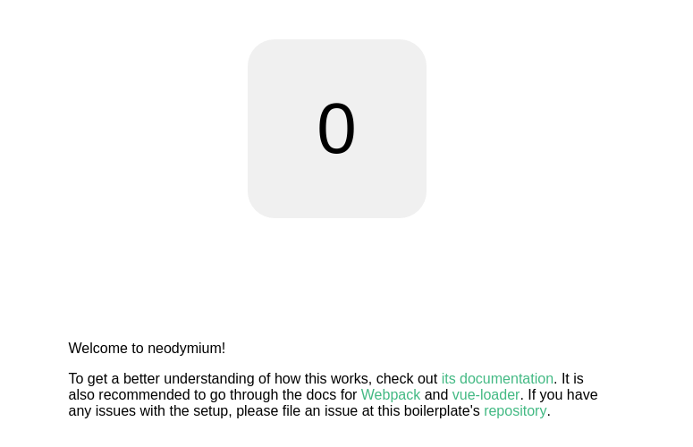
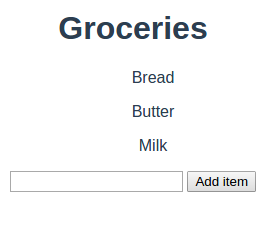

Neodymium
=========

Introduction - What is nd?
--------------------------

Neodymium (or nd for short) is a project template for a Node.js + HTML + CSS application. Nd uses the following Node.js tools to create a basic skeletton for a new app:

* `npm` or `yarn`, to install your application, tools and dependencies

* [Vue.js](https://vuejs.org/v2/guide/): the Model-View engine which generates your HTML code at runtime.

* [Webpack 2](https://webpack.js.org/): the server-side build tool that bundles your application into something your browser can read.

* [vue-cli](https://github.com/vuejs/vue-cli): the tool that downloads and installs nd.

* [electron](https://electron.atom.io/): the browser-like tool which displays your app (if you distribute it as a binary executable).

* [eslint](http://eslint.org/): the linter which you can use to point out probable mistakes in your code.

To understand this tutorial, you need to be familiar with Node.js and its tools (at the very least, `npm`), and with Vue.js (read at least the official tutorial). Being familiar with Webpack and electron and the other tools is a plus, but not necessary.

The aim of nd is to simplify making a Webpack application: in theory, all you have to do is provide nd with a few custom attributes (project name, description), and let it take care of the boilerplate code for you.

In practice, you may need to look at the boilerplate code at some point to understand how your project is built.

### Our first app

For this tutorial, we will develop a basic "Grocery List" app.

It will be a simple one-page application, with a list of grocery items. Each item will be made of a checkbox, and a line of text which will be crossed out when the box is checked. Below all items, there will be a text input zone and a button to add more items.

The final app should look like this:


This tutorial will take you through the process of installing, developping and running this app with nd.

Install
-------

First off, you need vue-cli to install nd:

    $ npm install -g vue-cli

`vue-cli` is a command line tool for installing project templates. You can use it to download and configure a new project with:

    $ vue init soixantecircuits/nd my-grocery-list

(Note that while the package is named `vue-cli`, the command it installs is named `vue`; "cli" stands for "Command Line Interface")

`vue init` asks you to name the project, add a description, etc; for now you can leave these options to their default values. The most important question is whether or not you want electron support; leave it to "yes".

Next, install dependencies in your `node_modules` folder:

    $ cd my-grocery-list
    $ npm install

Your project is now installed; for now, it only has a showcase app, with some links and a counter component. You can display it with:

    $ npm run dev




Making the app
--------------

### The nd pipeline

First, we need to understand what goes on under the hood, when the previous screen is displayed. What goes from typing `npm run dev` to displaying "Welcome to neodymium"?

Well, the pipeline is somewhat convoluted, but it goes like this:

* First, `npm run dev` reads the `package.json` objects, looks for the `scripts.dev` string, and runs it, which runs `node build/dev-server.js`

* `dev-server.js` is a complex file; but the gist of it is, it runs a Webpack server and an electron client; the server sends `index.html` and `src/main.js` to the client

* `src/main.js` replaces the HTML element with id "app" in `index.html` with the components `src/components/App.vue`

* `src/components/App.vue` is an indirection, which displays the component returned by `src/lib/router.js`; usually this is the Root component in `src/Root.vue`

If you didn't understand everything, don't worry. You only need to remember that the effective entry point of your app is `src/Root.vue`; and indeed, if you open it, you can see the HTML code for the content of the default showcase app, inside the `<template>` tags.

### What is this `.vue` business?

If you aren't familiar with Webpack, the presence of `.vue` files may surprise you. How do they fit into the project?

A Webpack application is not exclusively made of `.html` and `.js` files. Webpack allows you to define custom extensions, and to associate loaders to them. By default, a wepack project would not recognize `.vue` files; however, Neodymium configures Webpack (in `build/webpack.base.conf.js`, if you're curious) to detect `.vue` files, and run the `vue-loader` plugin on them every time they're imported through `require` or `import`.

For instance, in `Root.vue`, the line `import Counter from './components/Counter'` is actually parsed by Webpack, which detects the `src/components/Counter.vue` file, runs `vue-loader` on it, and stores the result in the `Counter` object in the `Root.vue` script.

Each `.vue` file represents a Vue-js component, as if it were created by the `Vue.component` method, with the contents of the `<template>` tag as its `template` parameter, and the object exported inside the `<script>` tags as its other parameters. The content of the `<style>` tags, however, is applied to the entire application (which may be a source of confusing mistakes).

For more information, read the official guide on [Components](https://vuejs.org/v2/guide/components.html) and [Single File Components](https://vuejs.org/v2/guide/single-file-components.html).

### Writing the app

For starters, open `src/Root.vue` and replace the contents of the `<template>` section with the following code (or, alternatively, your own):

```
<div id="app">
  <h1>Groceries</h1>
  <div id="grocery-list">
    <p class="grocery-item" v-for="item_name of items">
      {{ item_name }}
    </p>
  </div>
  <input text />
  <button>Add item</button>
</div>
```

Then, replace the contents of the `<script>` section with the following code:

```
'use strict'

export default {
  data() { return {
    items: ["Bread", "Butter", "Milk"],
    next_item: ""
  }},
  methods: {
    add_item() {
      if (this.next_item) {
        this.items.push(this.next_item)
        this.next_item = "";
      }
    }
  }
}
```

This is the standard vue model: the code defining data and operations is written in the `<script>` section, and the code defining how to display this data is written in the `<template>` section.

Run `npm run dev` again; your app should now look like this:



### Add component

Most apps are made of several components, to allow developpers to compartimentalize and reuse code.

We will create a `GroceryItem` component, which will include a line of text, and a checkbox that crosses the text out when it's clicked.

Create a new file in the component folder:

    $ cd src/components
    $ touch GroceryItem.vue

And paste the following code into it:

```
<template>
  <div class="grocery-item" :class="{strike: checked}">
    <input type=checkbox v-model="checked"></input>
    {{ name }}
  </div>
</template>

<script>
'use strict'

export default {
  props: ["name"],
  data() { return {
    checked: false
  }}
}
</script>

<style>
  .strike {
    text-decoration: line-through;
  }
</style>
```

To include this component in `Root.vue`, replace the `{{ item_name }}` line with:

```
<grocery-item :name="item_name" />
```

and replace the beginning of your `<template>` section with:

```
'use strict'

import GroceryItem from './components/GroceryItem'

export default {
  components: {
    GroceryItem
  },

  data() { return {
  ...
```

Run `npm run dev` again; your app should look like this at last:


Build and test
--------------

The nd template includes multiple scripts in `package.json`;

To check that your project respects the `standardJS` norm, you can run `eslint` on your files with:

    npm run lint

To build your project into an executable binary file, run:

    npm run build

This will create a build in the `releases` folder.


Conclusion
----------

You should now have a fully functional Grocery List app.

If you have any questions or remarks, you can contact us through [our website](http://soixantecircuits.fr/), or leave an issue with a `[TUTORIAL]` prefix here on Github.

Good luck with your apps!
